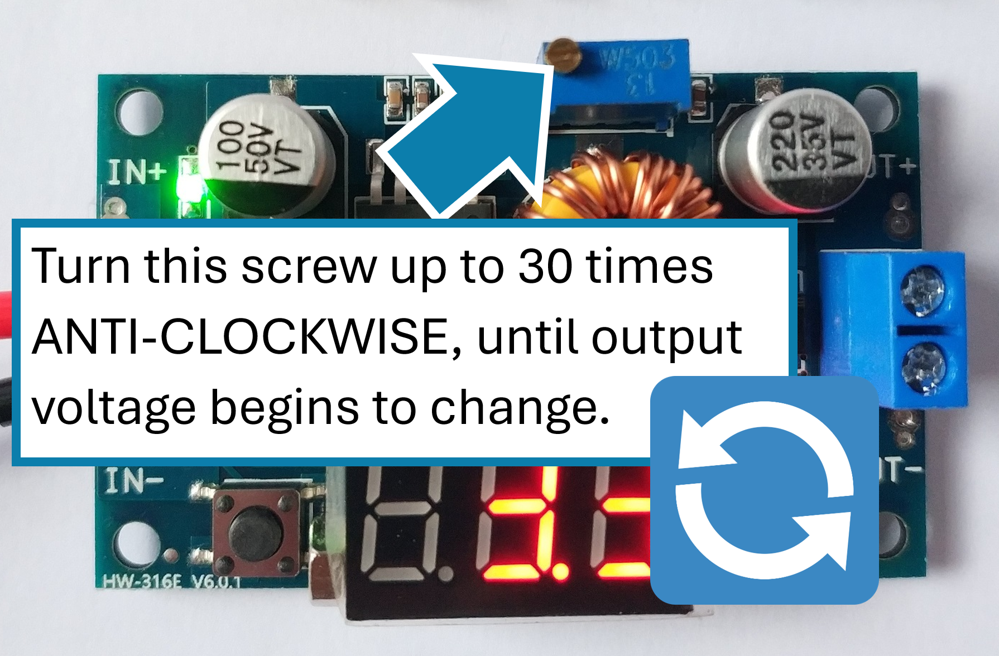

# Help with your XL4015 with LED display
Here's a few things that might be able to remedy problems you might be having with your XL4015 module.

## Initial Setup

!!! warning "IMPORTANT - Initial Setup"

    Please note that initially these modules may require significant turns of the potentiometer **ANTI-CLOCKWISE** until they spring into life.  **THIS CAN BE UP TO 30 TURNS**.

    Ensure your LED display is showing OUTPUT voltage whilst doing this.

    You can flip between showing OUTPUT or INPUT voltages by tapping the rightmost button.

    

## Calibration
Sometimes the display of the input or output voltage may show a value that is slightly out of the true value measured.  This can be corrected by the following calibration routine steps.

!!! abstract "Calibration routine - OUTPUT voltge"

    1. Ensure the "OUT" LED is lit, showing the output voltage (IN/OUT display can be flipped by pressing the rightmost button).
    2. Press the rightmost button for more than 2 seconds, then release it.
    3. The voltmeter "OUT" LED flashes.
    4. Tap the leftmost or rightmost button until the LED display is matching your calibrated readout (for example, your multi-meter).
    5. Hold the rightmost button to lock in the completed calibration.

!!! abstract "Calibration routine - INPUT voltge"

    1. Ensure the "IN" LED is lit, showing the input voltage (IN/OUT display can be flipped by pressing the rightmost button).
    2. Press the rightmost button for more than 2 seconds, then release it.
    3. The voltmeter "IN" LED flashes.
    4. Tap the leftmost or rightmost button until the LED display is matching your calibrated readout (for example, your multi-meter).
    5. Hold the rightmost button to lock in the completed calibration.

## Product Features

* LED power indicator.
* Button to switch the display to show input voltage or output voltage on the LED display.
* Button to turn the display off.
* LED to indicate that the display is showing either the input or output voltage.
* Input voltage: 4 to 38 VDC (do not exceed 38 volts).
* Output voltage: 1.25 to 36 VDC (adjustable) - Note: Display may only show as low as 4v.
* Output current: 0-5A
* Output power: 75W
* Efficiency: Up to 96%
* A calibration mechanism to ensure the display is perfectly accurate (see below for steps).