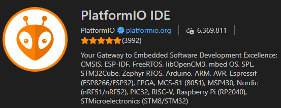
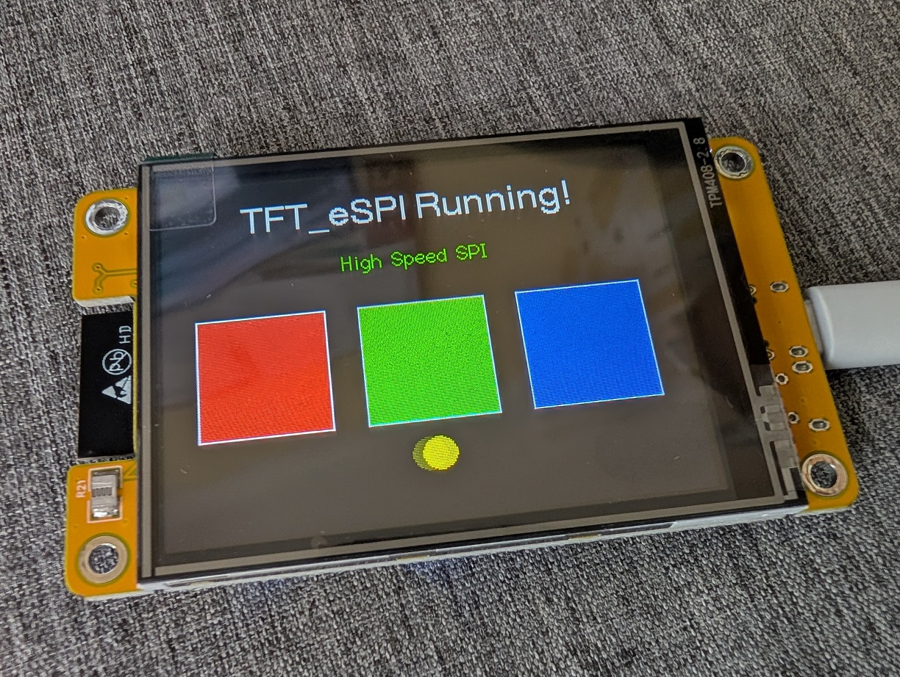

# CYD - Tutorial

This very brief tutorial aims to get you up and running with your CYD in the vscode and PlatformIO environment.  There are many other ways to program your CYD, and as much as Hobby Stuff would like to, cannot cover all possible routes into the software development world!

## 1. Install vscode
Visual Studio Code (also known as vscode) is available freely at [code.visualstudio.com/download](https://code.visualstudio.com/download).

## 2. Add the PlatformIO extension
Within vscode, from your left menu bar, select Extensions, search for PlatformIO IDE, then click Install.

!!! info ""
    

## 3. Create the project in PlatformIO

3.1. Within vscode, go to PlatformIO and select Create New Project.

3.2. Give your project a name, select the **Espressif ESP32 Dev Module** and **Arduino** Framework.

!!! info ""
    

## 4. Add TFT_eSPI library

4.1. Within vscode, select Quick Access > PIO Home > Libraries.

4.2. Search for the **TFT_eSPI** library by **Bodmer**.  Select **Add to Project**.
!!! info ""
    

## 5. Update platformio.ini

Open your platform.ini file and update it with the following contents:

```json title="platformio.ini"
[env:esp32dev]
platform = espressif32
board = esp32dev
framework = arduino
monitor_speed = 115200

lib_deps =
    bodmer/TFT_eSPI

build_flags =
    -D USER_SETUP_LOADED=1
    
    ; Define the driver
    -D ST7789_DRIVER=1
    
    ; Define the pins for ESP32-2432S028 (CYD)
    -D TFT_MISO=12
    -D TFT_MOSI=13
    -D TFT_SCLK=14
    -D TFT_CS=15
    -D TFT_DC=2
    -D TFT_RST=-1
    -D TFT_BL=21
    
    ; Fix the Red/Blue color swap
    -D TFT_RGB_ORDER=TFT_BGR
    
    ; Invert colors if the screen looks like a photo negative
    ;-D TFT_INVERSION_ON 
    
    ; Load Fonts
    -D LOAD_GLCD=1
    -D LOAD_FONT2=1
    -D LOAD_FONT4=1
    
    ; SPI Speed (55MHz is usually stable for writing)
    -D SPI_FREQUENCY=55000000
    -D SPI_READ_FREQUENCY=20000000
    -D SPI_TOUCH_FREQUENCY=2500000
```

## 6. Add the code

Finally, we get to add some code.  Try this out as your **main.cpp** file:

```cpp title="main.cpp"
#include <Arduino.h>
#include <TFT_eSPI.h>
#include <SPI.h>

// Initialize the library
TFT_eSPI tft = TFT_eSPI(); 

void setup() {
  Serial.begin(115200);
  
  // 1. Initialize Display
  tft.init();
  tft.invertDisplay(false);

  // 2. Set Rotation (1 = Landscape, 3 = Inverted Landscape)
    tft.setRotation(1);

  // 3. Turn on Backlight 
  // (We still do this manually to be safe, even though we defined it in build flags)
  pinMode(21, OUTPUT);
  digitalWrite(21, HIGH);

  // 4. Clear Screen
  tft.fillScreen(TFT_BLACK);

  // 5. Draw Text
  // TFT_eSPI uses distinct font numbers (2 and 4 are good basic ones)
  tft.setTextColor(TFT_WHITE, TFT_BLACK); // White text, Black background
  tft.drawCentreString("TFT_eSPI Running!", 160, 20, 4); // Centered at x=160

  tft.setTextColor(TFT_GREEN, TFT_BLACK);
  tft.drawCentreString("High Speed SPI", 160, 60, 2);

  // 6. Draw Shapes to verify Color and Position
  // If platformio.ini is correct, Red should be Red, Blue should be Blue
  tft.fillRect(20, 100, 80, 80, TFT_RED);
  tft.fillRect(120, 100, 80, 80, TFT_GREEN);
  tft.fillRect(220, 100, 80, 80, TFT_BLUE);
  
  // Draw outlines
  tft.drawRect(20, 100, 80, 80, TFT_WHITE);
  tft.drawRect(120, 100, 80, 80, TFT_WHITE);
  tft.drawRect(220, 100, 80, 80, TFT_WHITE);
}

void loop() {
  // Simple animation to show speed
  // Bouncing Ball
  static int x = 160;
  static int y = 200;
  static int dx = 3;
  
  // Erase previous circle (draw black over it)
  tft.fillCircle(x, y, 10, TFT_BLACK);
  
  // Update position
  x += dx;
  
  // Bounce off edges (Landscape width is 320)
  if (x > 310 || x < 10) dx = -dx;
  
  // Draw new circle
  tft.fillCircle(x, y, 10, TFT_YELLOW);
  
  delay(10); // Very short delay for smooth animation
}
```
## Success!

And there we have it, your CYD should be up and running!

!!! info ""
    