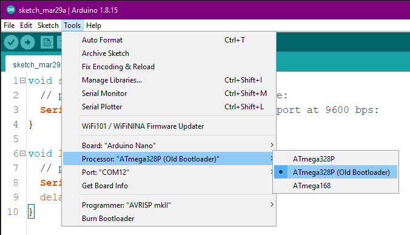
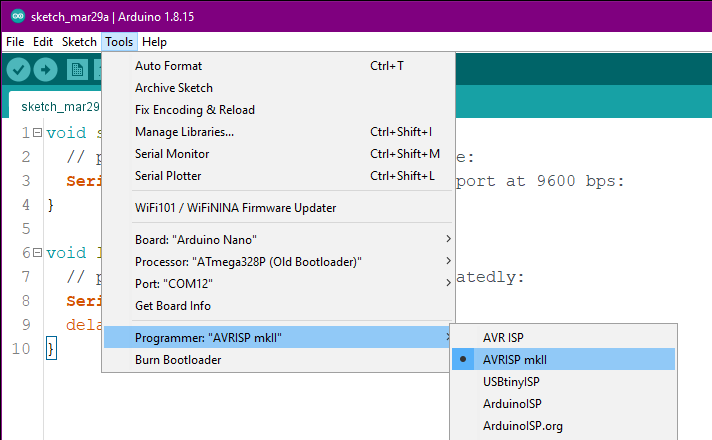

# Help with your Nano
Here's a few things that might be able to remedy problems you might be having with your Nano.

Note that this guide assumes you are using a Windows PC.

## 1. Checking Device Manager
If you look at Device Manager (you can do this by going to your Windows programs and searching for "Device Manager"), does the Nano show up under your Ports? It should be called something like USB-SERIAL CH340.

__1a.__ If the device is not showing in Device Manager, and you have not previously used the USB cable before for serial data connections, try different cables. We have found that not all cables are what they appear to be.

__1b.__ If it's not showing in Device Manager... you may need to download the CH340 drivers.  A good set of instructions of how to do this are available over at SparkFun (link).

## 2. Checking the COM port
Whilst still in Device Manager, note the COM port that the Nano appears under... this can change seemingly at random on the whim of Windows. This should match your Arduino IDE port (under Arduino IDE... Tools... Port).

## 3. Arduino IDE settings
Getting onto what the Arduino IDE settings should be...

__3a.__ The board should be set as an Arduino Nano under the following menu options:

Arduino IDE > Tools > Board > Arduino AVR Boards > Arduino Nano.

If the Arduino AVR Boards section isn't there, you can install it from Boards Manager by searching for "AVR".

__3b.__ For processor, first try selecting __ATmega328P (Old Bootloader)__.
If that doesn't work, try __ATmega328P__.

__3c.__ For programmer, use __AVRISP mkII__.

## 4. Delays
Are you in a situation where your Nano has been able to upload sketches previously, but is now not uploading...

If programming with the Arduino framework, in your loop() code, always be sure to put some sort of a delay in there. It's advised to have at at least a delay(10). Without this, the device can go into a constant non-stop loop, in which it's astutely determined to do ONLY what it's been told, neglecting listening out for new code to be uploaded.

__4a.__ If you have previously uploaded code, and without a delay in it... you can try the following sequence of steps:

> Hold the reset button on the Nano...
> Start uploading your code via Arduino IDE...
> When Arduino IDE reaches the message that it's trying to upload, release the reset button.

The board will then wait for a moment to see if there's a sketch waiting to be uploaded, and with a bit of luck, succeed in uploading your new sketch.

__4b.__ If you've previously uploaded code, you can try to enter bootloader mode. To do this you can follow instructions on the Arduino website (link). 

## Still having problems?
If you're still having problems after all the above steps, then do please [reach out to Hobby Stuff](https://hobbystuff.co.uk/pages/contact) to see how we can work to best resolve the situation.