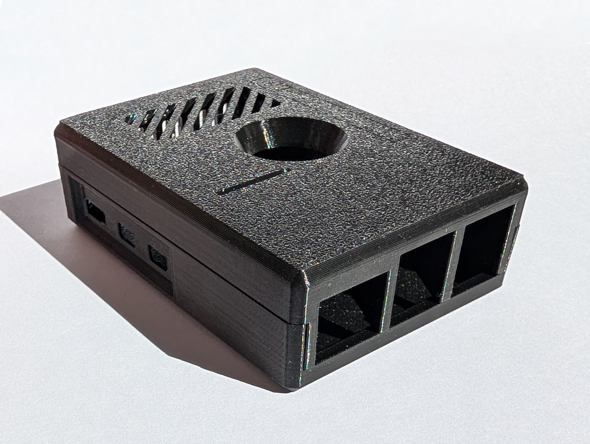

# Welcome
Need extra info on your purchase or inspiration for projects?

Hobby Stuff have compiled a series of tips and notes which may be able to help you get over these bumps in the road.

If you have any suggestions to tutorials or links which have helped you out, [please do send it on to us](https://hobbystuff.co.uk/pages/contact).

### Find help for your...

!!! abstract "Cheap Yellow Display (CYD)"

    

    [:octicons-arrow-right-24: Get started](Single-Board-Computers/CYD.md)

!!! abstract "Pi4 / Pi5 case"

    

    [:octicons-arrow-right-24: Get started](Cases/pi.md)

!!! abstract "ESP32-CAM"

    

    [:octicons-arrow-right-24: Get started](Single-Board-Computers/esp32cam.md)

!!! abstract "Nano"

    

    [:octicons-arrow-right-24: Get started](Single-Board-Computers/nano.md)

